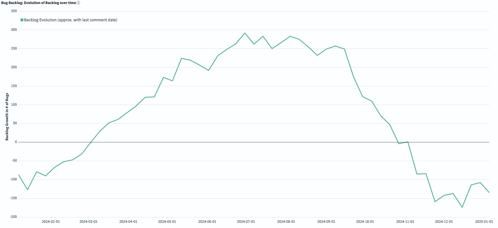
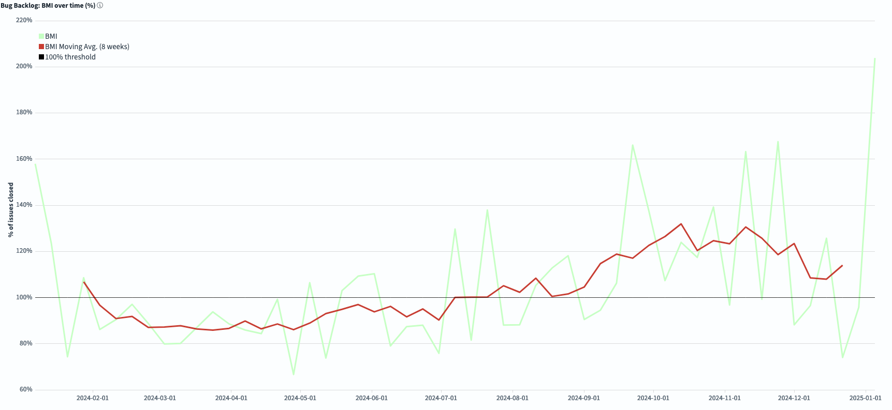

# FreeBSD Foundation STA Work Package A (Tech Debt) Update \- December 2024

| Reporting Period | 01 DEC 2024 to 31 DEC 2024 |
| :---- | :---- |
| Report Author | [Alice Sowerby](alice@freebsdfoundation.org) |
| Report approved by | [Ed Maste](emaste@freebsdfoundation.org) |
| For Commissioning Body | Sovereign Tech Agency |

## Community engagement

The Foundation continues to work with the FreeBSD Project’s Source Management team to:

* Adopt and utilise the new Grimoirelab dashboards to understand the character and trends in the bug backlog.  
* Develop technical debt management processes that leverage the understanding and visibility of impact that the dashboards provide.   
* Reduce technical debt by providing contractor time.   
* Host community bug triage events by promoting and attending them, and offering paid-for “webinar” Zoom features as needed.

The Source Management team held a public bug-remediation event for the community on 2024-12-06 which was a successful pilot event that allowed the team to test and improve their approach to collaborative bugfixing. 

We have further refined the [GrimoireLab dashboards](https://grimoire.freebsd.org/) instance which had a few bugs of its own. We made a public copy of the dashboard documentation to support the FreeBSD community in their understanding and use of the dashboards: [https://github.com/freebsd/grimoire](https://github.com/freebsd/grimoire) 

Our marketing team has connected with Bitergia to help share more widely the experience of hosting this open-source tool on FreeBSD as an alternative to hosting it on Linux. This helps to provide a diverse choice of platforms for the tool which itself is used by many open source projects for community health analytics. 

## Project Progress

The project is in its final stages, and we are focusing on supporting the Source Manager team to put in place its updated processes, ensure the dashboards are working properly, and carry out bug triage and remediation.

We have had reduced developer availability due to holidays and have agreed with the STA to move some of the work on technical debt reduction into early 2025 (Jan and Feb).

The impact of the bug triage and remediation work can be seen in some of the new dashboard views:

The *Evolution of the Backlog* graph shows how the backlog has changed during the selected time frame. Negative numbers mean you are reducing the total backlog.  

*BMI (Backlog Management Index)* measures efficiency in closing issues. If you are above the 100% threshold, the team is closing more tickets than the ones received, so the backlog is decreasing. If you are below 100%, the backlog is growing.  

Both graphs show that the backlog has been shrinking and that we are closing more issues than are being raised. The changes seen do correlate with the STA-commissioned project, though direct causation cannot be asserted. The project has coincided with the formation of the Source Management team in the FreeBSD Project who have been our main stakeholders. Our collaboration with that team has created a focus on reducing technical debt, and developing processes and tooling to make that more efficient and effective. We have had qualitative feedback from the Source Management team that the project and its outcomes have been very helpful in enabling them in this work, and that they anticipate long-term benefits

## Risks, concerns, and variations

It can be difficult to project accurately the number of hours that the contractors will spend on things, especially because with open source work people do tend to have unpredictable availability. We are trying to keep our actual hours close to our projected hours and our contractors are becoming more familiar with the processes we use for the STA work. The STA has been supportive and constructive in helping us to adapt our agreement to achieve a successful outcome. 