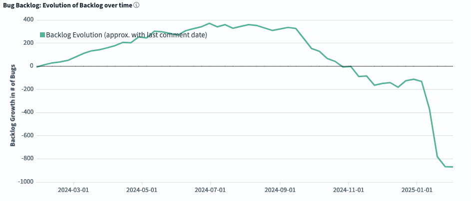
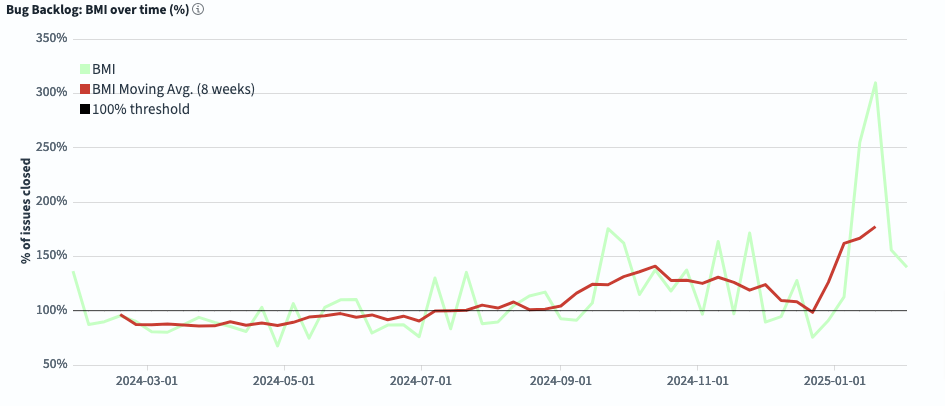

# FreeBSD Foundation STA Work Package A (Tech Debt) Update \- January 2025

| Reporting Period | 01 JAN 2025 to 31 JAN 2025 |
| :---- | :---- |
| Report Author | [Alice Sowerby](mailto:alice@freebsdfoundation.org) |
| Report approved by | [Ed Maste](mailto:emaste@freebsdfoundation.org) |
| For Commissioning Body | Sovereign Tech Agency |

## Community engagement

The Foundation continues to work with the FreeBSD Project’s Source Management team to:

* Adopt and utilise the new GrimoireLab dashboards to understand the character and trends in the bug backlog.  
* Develop technical debt management processes that leverage the understanding and visibility of impact that the dashboards provide.   
* Reduce technical debt by providing contractor time.   
* Upgrade bug management tooling.  
* Host community bug triage events by promoting and attending them, and offering paid-for “webinar” Zoom features as needed.  
* Promote the utility and use of GrimoreLab for open source communities.

The Source Management team held its second public bug-remediation event for the community on 2025-01-17 which was a successful event that allowed the team to test and improve their approach to collaborative bug fixing. This event was less well attended than the previous, we don’t know why. However, since the hosts are developing their format the next steps will be to start to promote the events to a wider audience, for example on the FreeBSD Discord server. This will hopefully build engagement in a new audience and lead to a broader, more diverse range of people interested in contributing to the management of technical debt in FreeBSD.

A new work item to the project is the upgrade of Bugzilla from an older, unsupported version, to a newer, supported version. This will provide valuable security and functionality improvements.

The FreeBSD Source Management team and FreeBSD Foundation has also been taking steps to share their experience and knowledge of using GrimoireLab, so that other open source communities can benefit from what we’ve learned. This includes:

* Being guests on an episode of the [CHAOSS community’s podcast](https://podcast.chaoss.community/103), CHAOSScast, along with Bitergia.  In the episode, Ed Maste (FreeBSD Foundation, Security Team, Release Engineering Team, Source Management Team), Moin Rahman (FreeBSD Foundation, Primary Release Engineering Team, Cluster Administrators Team), and Miguel Ángel Fernández (Bitergia) were hosted by Alice Sowerby (FreeBSD Foundation, CHAOSS) and discussed how they used GrimoireLab to understand and manage the FreeBSD bug backlog.   
* Creating upstream documentation of how to host GrimoireLab on FreeBSD. This is in progress and, once complete, will be submitted to the GrimoireLab GitHub repository for all users to use. 

## Project Progress

The project is in its last stage, and we are focusing on supporting the Source Manager team to put in place its updated processes, ensure the dashboards are working properly, and carry out bug triage and remediation. We are also supporting the contractor time needed to upgrade Bugzilla. 

Since the December report, we have been reviewing the expected vs actual spend on this work package. There is currently an underspend in 2024\. We are currently working on a revised plan to propose to STA which will include this and other amends to the budget to deliver the project in an agreed manner.

The impact of the bug triage and remediation work can be seen in some of the new dashboard views:

The *Evolution of the Backlog* graph shows how the backlog has changed during the selected time frame. Negative numbers mean you are reducing the total backlog.  

*BMI (Backlog Management Index)* measures efficiency in closing issues. If you are above the 100% threshold, the team is closing more tickets than the ones received, so the backlog is decreasing. If you are below 100%, the backlog is growing.

Since the start of 2025, both graphs show that the backlog has been dramatically shrinking and that we are closing more issues than are being raised. The changes correlate with the STA-commissioned project, though direct causation cannot be asserted. The project has coincided with the formation of the Source Management team in the FreeBSD Project who have been our main stakeholders. Our collaboration with that team has created a focus on reducing technical debt, and developing processes and tooling to make that more efficient and effective. We have had qualitative feedback from the Source Management team that the project and its outcomes have been very helpful in enabling them in this work, and that they anticipate long-term benefits. Additionally, some of the contractor hours covered by the project have been used directly in triaging and remediating bugs.

## Risks, concerns, and variations

As mentioned earlier in this report, there are some adjustments underway to the overall plan for the STA-commissioned work including this work package. There remains a limited pool of developers we can access for this deep and broad area of work which means that as we start the other work packages some people (paid and volunteer) are being asked to find time for several things. Even our paid contractors are often contributing into processes that rely on volunteer time and goodwill and which can progress at an uneven rate. 