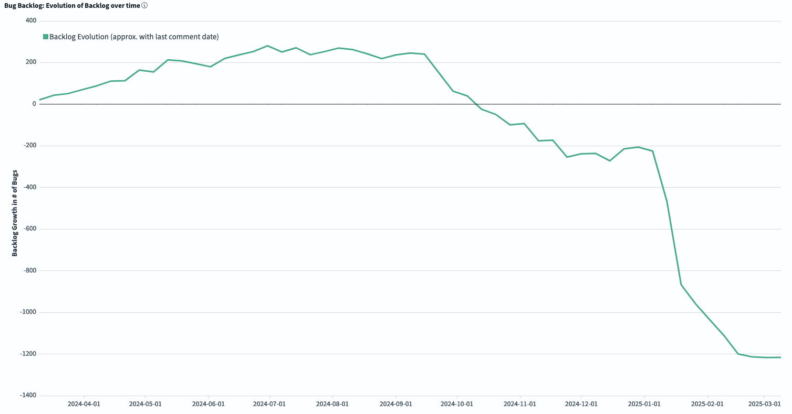
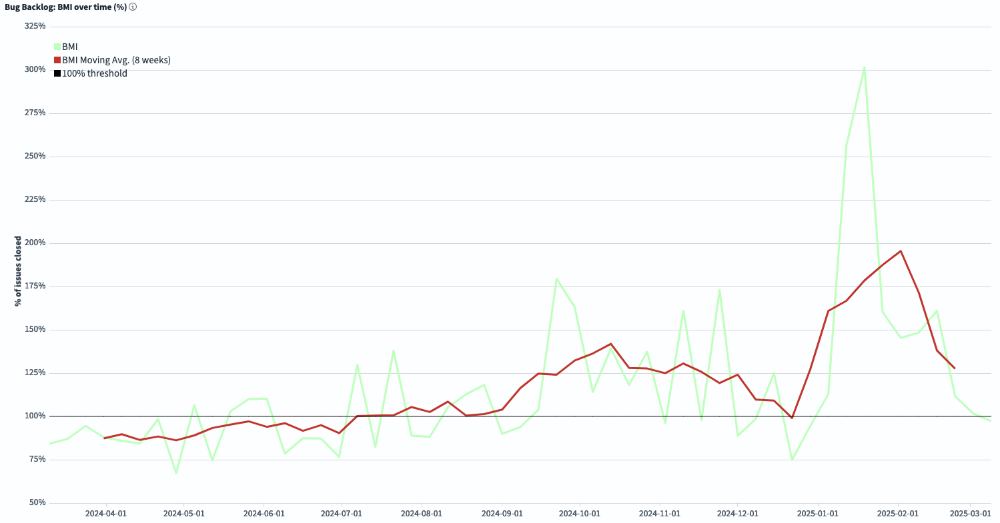

# FreeBSD Foundation STA Work Package A (Tech Debt) Update \- February 2025

| Reporting Period | 01 FEB 2025 to 28 FEB 2025 |
| :---- | :---- |
| Report Author | [Alice Sowerby](mailto:alice@freebsdfoundation.org) |
| Report approved by | [Ed Maste](mailto:emaste@freebsdfoundation.org) |
| For Commissioning Body | Sovereign Tech Agency |

## Community engagement

The Foundation continues to work with the FreeBSD Project’s Source Management team to:

* Adopt and utilise the new GrimoireLab dashboards to understand the character and trends in the bug backlog.  
* Develop technical debt management processes that leverage the understanding and visibility of impact that the dashboards provide.   
* Reduce technical debt by providing contractor time.   
* Upgrade bug management tooling.  
* Host community bug triage events by promoting and attending them, and offering paid-for “webinar” Zoom features as needed.  
* Promote the utility and use of GrimoreLab for open source communities.

The Foundation has [submitted documentation](https://github.com/chaoss/grimoirelab/pull/737) for how to run GrimoireLab on FreeBSD to the upstream GrimoireLab project (CHAOSS project’s open source dashboarding tool). This will make it much easier for other people in the world to know that it can be run on FreeBSD, and how to do it. This is a good way to raise the profile of FreeBSD in another community while providing more utility in their project.

The Source Management team held its third public bug-remediation event for the community on 2025-02-28 which was a successful event with around 16 people attending. The session started with a focus on new bugs (submitted in 2025), and then moved on to reviewing older bugs with attached patches.

We upgraded our bug tracking system, Bugzilla, to a newer version, improving overall security and adding new features for users. We also created a new tool that simplifies how we handle implementing upstream patches to the system, making the process more reliable. Patches from 2023 onward have been applied to our instance of Bugzilla. We're now working to further streamline this process to ensure future patches and upgrades can be implemented more easily.

## Project Progress

The project is in a lower resourced stage as we run fewer hours on it for the next few months. This will help processes to have a longer time to bed in with the dashboards and bug triaging events, as well as supporting the updates for Bugzilla and GrimoireLab. We will also be considering specific steps we can take to hand over management of GrimoireLab fully to the community.

The impact of the bug triage and remediation work can be seen in some of the new dashboard views:

The *Evolution of the Backlog* graph shows how the backlog has changed during the selected time frame. Negative numbers mean we are reducing the total backlog.  

*BMI (Backlog Management Index)* measures efficiency in closing issues. If you are above the 100% threshold, the team is closing more tickets than the ones received, so the backlog is decreasing. If the BMI is below 100%, the backlog is growing.

These graphs show that the backlog is continuing to reduce, but at a slower rate than last month. This may well be because the contractor who is working on the Bugzilla is the same person who has been tackling a lot of the bugs as a volunteer. He may have less time now that he has started the Bugzilla work. The average BMI has remained above 100% since we started the project.

## Risks, concerns, and variations

This work package is in a good state, and we have time to prepare for the off-ramp later in the year. We are keen to ensure a sustainable handoff to the community, which remains the main area of risk. There is some variability in the time available from our main contractor, but overall we believe that it’s more likely that he would complete his work earlier rather than later. Given the low number of hours (20h per month), this would not create a large effect on the invoice schedule. We are monitoring the risks.