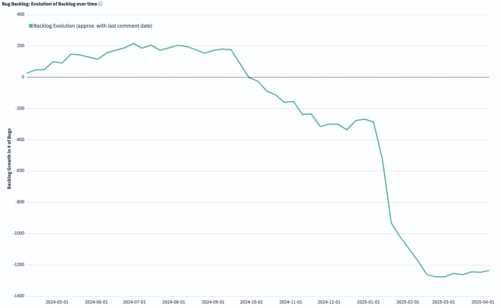
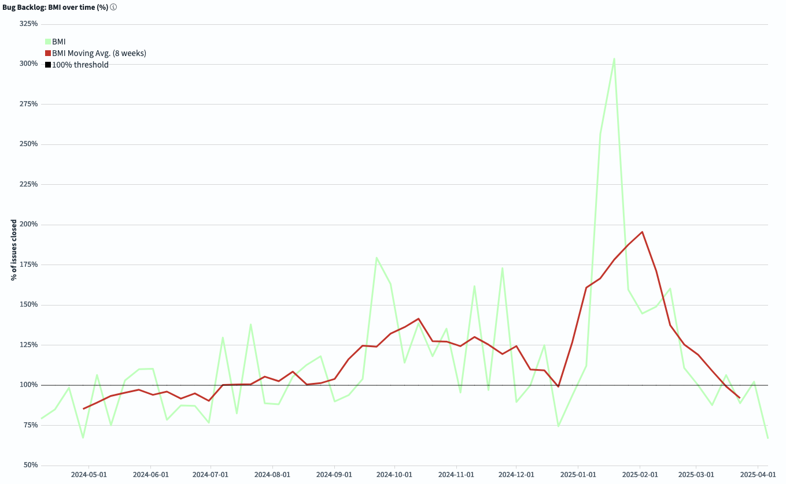

# FreeBSD Foundation STA Work Package A (Tech Debt) Update \- March 2025

| Reporting Period | 01 MAR 2025 to 31 MAR 2025 |
| :---- | :---- |
| Report Author | [Alice Sowerby](mailto:alice@freebsdfoundation.org) |
| Report approved by | [Ed Maste](mailto:emaste@freebsdfoundation.org) |
| For Commissioning Body | Sovereign Tech Agency |

## Community engagement

The Foundation continues to work with the FreeBSD Project’s Source Management team to:

* Adopt and utilise the new GrimoireLab dashboards to understand the character and trends in the bug backlog.  
* Develop technical debt management processes that leverage the understanding and visibility of impact that the dashboards provide.   
* Reduce technical debt by providing contractor time. 

The Foundation published a blog post to promote the CHAOSS podcast that had been previously released [https://freebsdfoundation.org/blog/from-chaos-to-clarity-how-we-tackled-freebsds-7000-bug-backlog/](https://freebsdfoundation.org/blog/from-chaos-to-clarity-how-we-tackled-freebsds-7000-bug-backlog/) 

The Source Management team did not hold any bug busting sessions in March due to travel and schedule constraints.

## Project Progress

This month has been relatively quiet as most of the main goals of this work package are now complete. 

We continue to address bug triage and remediation throughout this stage of the project. We are transitioning the management of the dashboards to the community, and identifying any areas where we can help create sustainable processes to update for Bugzilla and GrimoireLab regularly. Some further work to maintain GrimoireLab and create a sustainable way to implement update patches for Bugzilla has also been completed.

The impact of the bug triage and remediation work can be seen in some of the dashboard views:

The *Evolution of the Backlog* graph shows how the backlog has changed during the selected time frame. Negative numbers mean we are reducing the total backlog.  

*BMI (Backlog Management Index)* measures efficiency in closing issues. If you are above the 100% threshold, the team is closing more tickets than the ones received, so the backlog is decreasing. If the BMI is below 100%, the backlog is growing.

These graphs show that the backlog may have grown slightly in March. This seems to have been caused by an uptick in new bugs raised, as the number of bugs closed has remained the same per month. As we go through the last months of this work packages we will monitor this and confer with the Source Manager team to understand better how this looks on the ground and what else we can do to support them.

## Risks, concerns, and variations

This work package is in a good state, there are no obvious risks to successfully completing the project.