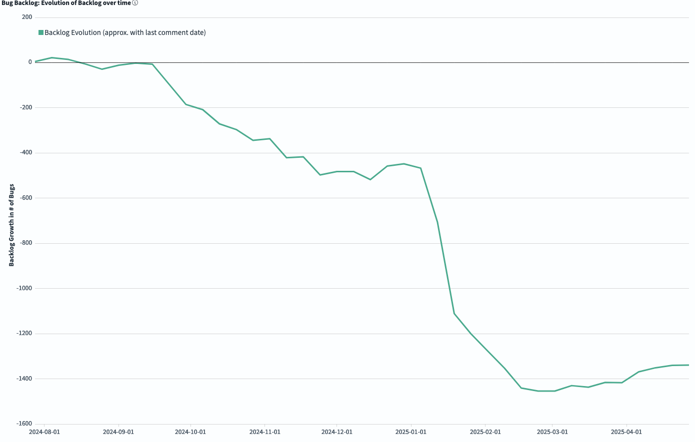
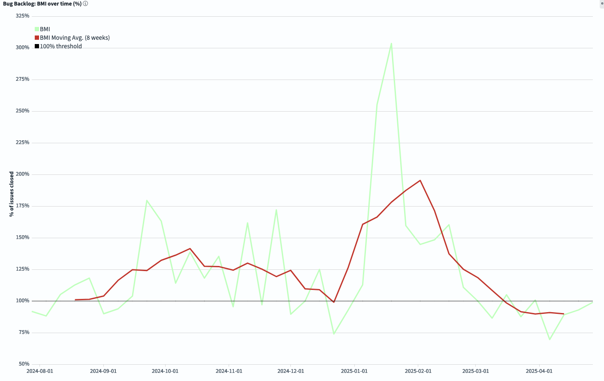

# FreeBSD Foundation STA Work Package A (Tech Debt) Update \- April 2025

| Reporting Period | 01 APR 2025 to 30 APR 2025 |
| :---- | :---- |
| Report Author | [Alice Sowerby](mailto:alice@freebsdfoundation.org) |
| Report approved by | [Ed Maste](mailto:emaste@freebsdfoundation.org) |
| For Commissioning Body | Sovereign Tech Agency |

## Community engagement

The Foundation continues to work with the FreeBSD Project’s Source Management team to:

* Adopt and utilise the new GrimoireLab dashboards to understand the character and trends in the bug backlog.  
* Develop technical debt management processes that leverage the understanding and visibility of impact that the dashboards provide.   
* Reduce technical debt by providing contractor time. 

The Foundation has submitted a panel discussion to [Open Source Summit Europe](https://events.linuxfoundation.org/open-source-summit-europe/) in August to share this work with a wider audience.

The Source Management team did not hold any bug busting sessions in March or April due to travel and schedule constraints.

## Project Progress

This month has been relatively quiet as most of the main goals of this work package are now complete. 

The Foundation has been reviewing the information available in the new dashboards to monitor the trends in the backlog and this has led to some interesting and useful discussions. 

We can see below that after the initial reduction of the backlog there has now been an upward trend in the number of open bugs. Combined with the BMI, which shows us how many bugs are opened and closed in a specific time period, we can see that this is due to additional bugs being opened while the close rate has remained consistent. Further analysis in the dashboards has uncovered that this is mainly occurring on the Ports and Packages codebase. The conversation then moved to a discussion of the long-standing culture of new code changes being raised in Bugzilla despite not actually being bugs. There are some reasons for this workaround but it’s distorting the graphs with “noise” that isn’t relevant to the “signal”. 

This is an example of the value of the dashboards as a long-term planning and management tool. They show the trends that then lead to discussions where we can answer questions through analysis of actual data. 

We are looking into the potential of redirecting some of the remaining hours to re-characterising the Ports and Packages bugs to filter out the “noise” and let us have a better understanding of the real bug trends. 

The *Evolution of the Backlog* graph shows how the backlog has changed during the selected time frame. Negative numbers mean we are reducing the total backlog.  

*BMI (Backlog Management Index)* measures efficiency in closing issues. If you are above the 100% threshold, the team is closing more tickets than the ones received, so the backlog is decreasing. If the BMI is below 100%, the backlog is growing.

Aside from the conversations about improving the bug characterisation, our contractor has been evaluating tools to get Bugzilla patches to be applied automatically. The preferred upstream tool has bugs which cannot be fixed trivially, and make it too fragile. We will need to switch this out for another method.

#### Risks, concerns, and variations

The work to date has been successful, and our thoughts now turn to proactively understanding what more we can do in the last few months to make sustainable, longer-lasting improvements. We have the tooling to see what is happening, and now we can start to dig into figuring out the mechanisms for making improvements.