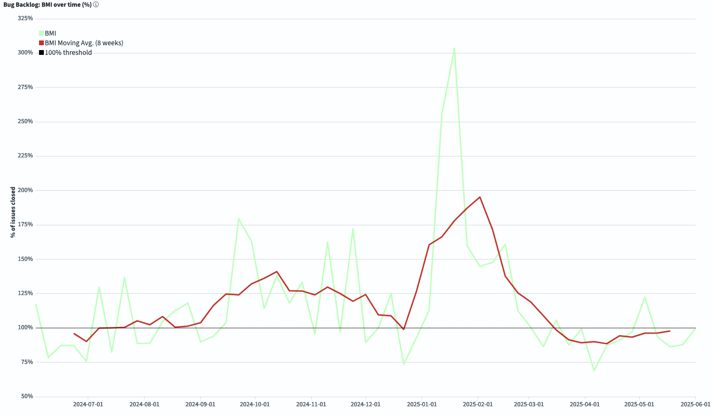
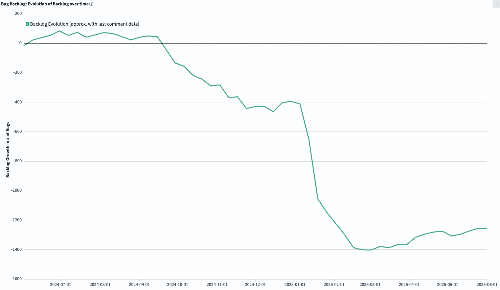

# FreeBSD Foundation STA Work Package A (Tech Debt) Update \- May 2025

| Reporting Period | 01 MAY 2025 to 31 MAY 2025 |
| :---- | :---- |
| Report Author | [Alice Sowerby](mailto:alice@freebsdfoundation.org) |
| Report approved by | [Ed Maste](mailto:emaste@freebsdfoundation.org) |
| For Commissioning Body | Sovereign Tech Agency |

## Community engagement

The Foundation continues to work with the FreeBSD Project’s Source Management team to:

* Adopt and utilise the new GrimoireLab dashboards to understand the character and trends in the bug backlog.  
* Develop technical debt management processes that leverage the understanding and visibility of impact that the dashboards provide.   
* Reduce technical debt by providing contractor time. 

The Foundation has been accepted to host a panel discussion at [Open Source Summit Europe](https://events.linuxfoundation.org/open-source-summit-europe/) in August to share this work with a wider audience. Two members of the Foundation project staff will be present, along with two representatives from Bitergia who delivered the GrimoireLab implementation for this project. 

Community-led bugbusting sessions are back, and now take several forms:

* A weekly 1h session on Discord, held by FreeBSD [Bugmeister](https://www.freebsd.org/administration/#t-bugmeister) team member Mark Linimon. This has been held for the last five weeks and is stabilizing in terms of routine and structure. This is a new format for bugbusting which hopes to reach a wider audience and bring in new people to hopefully increase bandwidth and resilience in the bug management process.   
    
  These sessions involved mostly triaging bugs across all of the source, base, and ports trees. They look at stale bugs, then look for whether those relate to recent supported versions or not, whether they are assigned properly or not, if there has been a timeout or not. And based on those, they take actions like closing, reassigning etc.  
    
* A monthly 3-4h session run by the Source Management team member, Mark Johnston. These sessions are more suited to established contributors as they mainly categorize bugs more thoroughly within the source tree (e.g. Kernel, WIFI, Virtualization, etc.) If those are easily resolved they may tackle them live or, if not, they assign them properly or ask for more detailed information which might help solving the issue. The last session was on 23rd May, and averaged approximately 15 attendees.  
* Ad hoc in-person sessions at community events. The Source Manager team plans to lead a session at the FreeBSD Developer Summit in June. Topics will include deprecation of 32-bit platforms, and pkgbase support for the upcoming FreeBSD 15.0 release.

## Project Progress

A recent update from our contractor shared some progress completed in April that wasn’t included in the April report. 

He has been working on reducing technical debt by creating an [automated method](https://github.com/linimon/patchQA) for evaluating patches (code improvements) attached to existing pull requests for source and ports trees to see whether they are still relevant, and applying them if they are. There are a few challenges with handling fuzzy input, but there is good progress in processing the PR backlog and rebasing them to the current state of the source tree. Some PRs that relate to Ports have patches that should be applied to the upstream project from which the FreeBSD port was taken. There is an early version of a script to automate sending those patches to the external projects in question. 

In the previous report, we saw some changes in the GrimoireLab graphs that showed the bug backlog had been increasing and the bugfix rate a little lower than previously. This month, the graphs show a reduced rate of increase to the backlog, and an increase in BMI (Backlog Management Index) that is heading back towards a 1:1 ratio of bugs raised to bugs closed. Based on what we know about recent contributor absences and the return of the bugbusting sessions this seems to fit with the qualitative insights we have.

The *Evolution of the Backlog* graph shows how the backlog has changed during the selected time frame. Negative numbers mean we are reducing the total backlog.  

*BMI (Backlog Management Index)* measures efficiency in closing issues. If you are above the 100% threshold, the team is closing more tickets than the ones received, so the backlog is decreasing. If the BMI is below 100%, the backlog is growing.

## Risks, concerns, and variations

None currently.