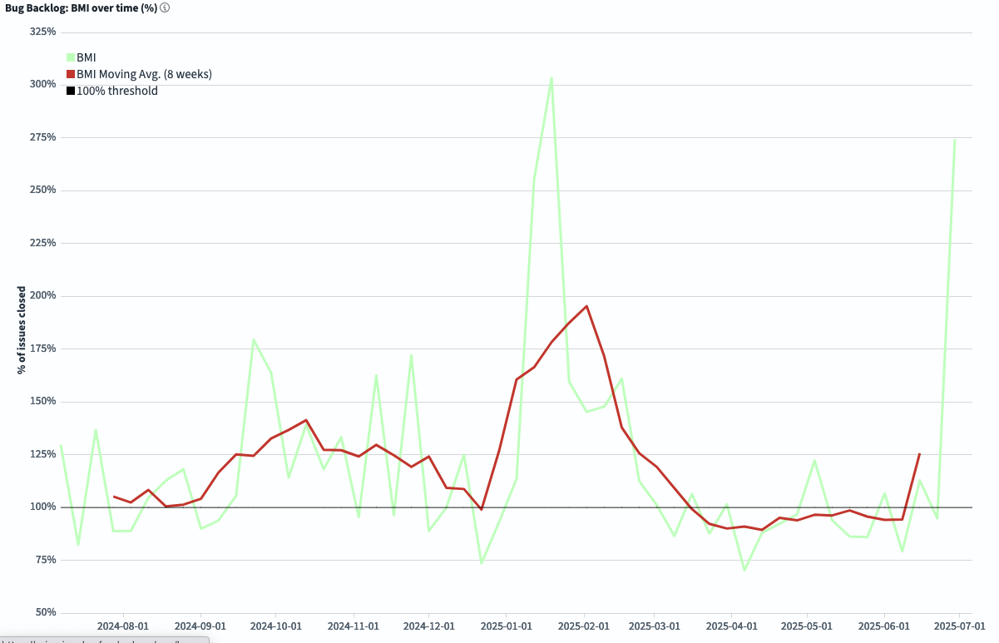
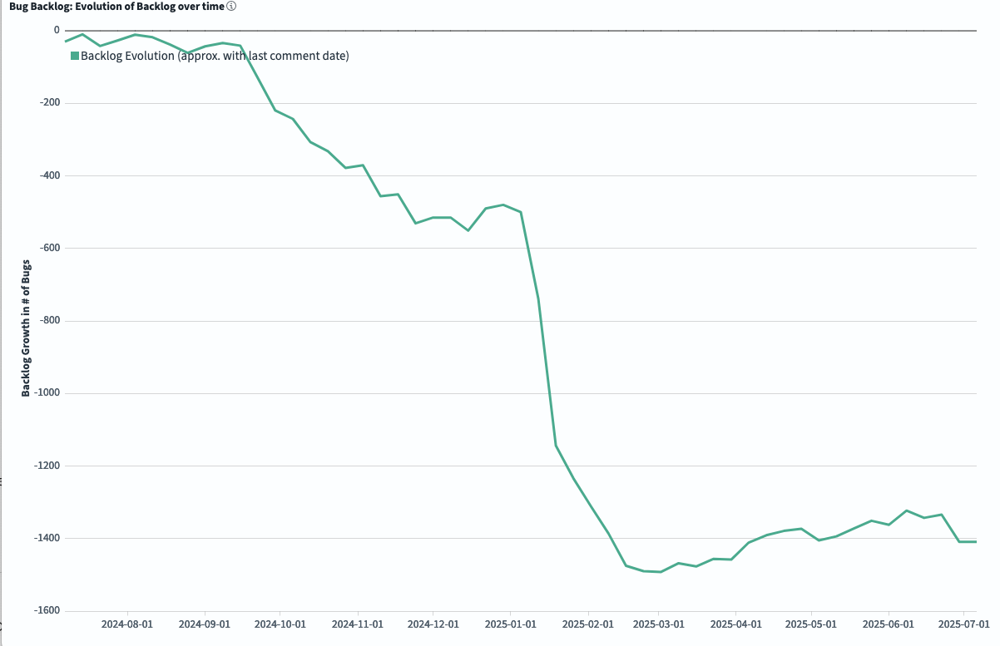

# FreeBSD Foundation STA Work Package A (Tech Debt) Update \- June 2025

| Reporting Period | 01 JUNE 2025 to 30 JUNE 2025 |
| :---- | :---- |
| Report Author | [Alice Sowerby](mailto:alice@freebsdfoundation.org) |
| Report approved by | Deb Goodkin |
| For Commissioning Body | Sovereign Tech Agency |

## Community engagement

The Foundation continues to work with the FreeBSD Project’s Source Management team to:

* Adopt and utilise the new GrimoireLab dashboards to understand the character and trends in the bug backlog.  
* Develop technical debt management processes that leverage the understanding and visibility of impact that the dashboards provide.   
* Reduce technical debt by providing contractor time. 

Planning is soon to begin for the panel discussion at [Open Source Summit Europe](https://events.linuxfoundation.org/open-source-summit-europe/) in August to share this work with a wider audience. Two members of the Foundation project staff will be present, along with two representatives from Bitergia who delivered the GrimoireLab implementation for this project. 

An update on all work packages was presented to the community in the [FreeBSD Foundation Technology Team update](https://www.youtube.com/live/9Gm-IGA2t0s?feature=shared&t=23882) at the FreeBSD Developer Summit in Ottawa on June 12th, 2025\. 

Community-led bugbusting sessions are continuing:

* Two 1h sessions have been held on Discord, led by FreeBSD [Bugmeister](https://www.freebsd.org/administration/#t-bugmeister) team member Mark Linimon. These took place on 2025-06-23 and 2025-06-30. These sessions involved mostly triaging bugs across all of the source, base, and ports trees. They look at stale bugs, then look for whether those relate to recent supported versions or not, whether they are assigned properly or not, and if there has been a timeout or not. And based on those, they take actions like closing, reassigning, etc.

## Project Progress

The monthly meetings are providing a useful structure for supporting the continued focus on maintaining and reducing the bug backlog, as the Source Management team and other key contributors are able to share their progress in developing processes and tooling.

Our contractor has:

*  Added new search queries to Bugzilla to help with understanding and monitoring maintainer attention on triaged bugs. These include search queries about Maintainer Approval (which applies to any attachments on the bug reports) and maintainer feedback (applies to an entire individual bug report).  The documentation on these has been updated:  [https://wiki.freebsd.org/Bugzilla/SearchQueries\#Searches\_For\_Maintainer\_Actions](https://wiki.freebsd.org/Bugzilla/SearchQueries#Searches_For_Maintainer_Actions)   
  He has used these queries to close various bugs, and also to investigate inactive maintainers though he has not taken action on the latter.  
* Fixed some problems with the setup of the latest upgrade on the bug tracking software, Bugzilla, and as summary testing has shown no remaining problems we will switch to this version (5.2) next quarter.   
* Created dozens of new Bugzilla accounts by user request, which is a great sign of new engagement around the bug management process.

Looking at GrimoireLab graphs we can see that the bug backlog continues to reduce, and that we are closing more bugs than are being raised. Based on what we know about work being done to tackle both the backlog and the process improvements, this seems to fit with the qualitative insights we have. Overall, we can see that the graphs are in agreement with what we see on the ground.

The *Evolution of the Backlog* graph shows how the backlog has changed during the selected time frame. Negative numbers mean we are reducing the total backlog.  

*BMI (Backlog Management Index)* measures efficiency in closing issues. If you are above the 100% threshold, the team is closing more tickets than the ones received, so the backlog is decreasing. If the BMI is below 100%, the backlog is growing.

## Risks, concerns, and variations

None currently.

