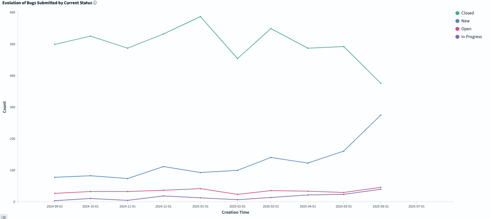

# FreeBSD Foundation STA Work Package A (Tech Debt) Update \- July 2025

| Reporting Period | 01 JULY 2025 to 31 JULY 2025 |
| :---- | :---- |
| Report Author | [Alice Sowerby](mailto:alice@freebsdfoundation.org) |
| Report approved by | Deb Goodkin |
| For Commissioning Body | Sovereign Tech Agency |

## Community engagement

The Foundation continues to work with the FreeBSD Project’s Source Management team to:

* Adopt and utilise the new GrimoireLab dashboards to understand the character and trends in the bug backlog.  
* Develop technical debt management processes that leverage the understanding and visibility of impact that the dashboards provide.   
* Reduce technical debt by providing contractor time. 

Planning is underway for the panel discussion at [Open Source Summit Europe](https://events.linuxfoundation.org/open-source-summit-europe/) in August to share this work with a wider audience. Two members of the Foundation project staff will be present, along with two representatives from Bitergia who delivered the GrimoireLab implementation for this project. 

Community-led bugbusting sessions were on pause for July due to vacation season.

## Project Progress

Discussion this month has turned to ensuring that the changes made in the work package persist after the end of the year. The Foundation has made a commitment to fund a quarterly update of GrimoireLab to ensure it benefits from stability and security improvements in newer releases. The Source Manager team will continue to use GrimoireLab to monitor and manage the backlog of bugs and plan for change in its approach as needed. 

Looking at GrimoireLab graphs we can see that the bug backlog has grown somewhat in July, which is explained by a reduction in bugs being closed (perhaps by the lack of bugbusting sessions this month) and an increase in the number of bugs being reported (cause unknown).  It still seems that overall, we can see that the graphs are in agreement with what we see on the ground.

The *Evolution of the Backlog* graph shows how the backlog has changed during the selected time frame. Negative numbers mean we are reducing the total backlog.  

*BMI (Backlog Management Index)* measures efficiency in closing issues. If the BMI is above the 100% threshold, the team is closing more tickets than the ones received, so the backlog is decreasing. If the BMI is below 100%, the backlog is growing.

To aid with understanding the cause of the changes, please see the additional graph below, which shows the trend in bugs being reported (blue) and closed (green).

## Risks, concerns, and variations

None currently.
